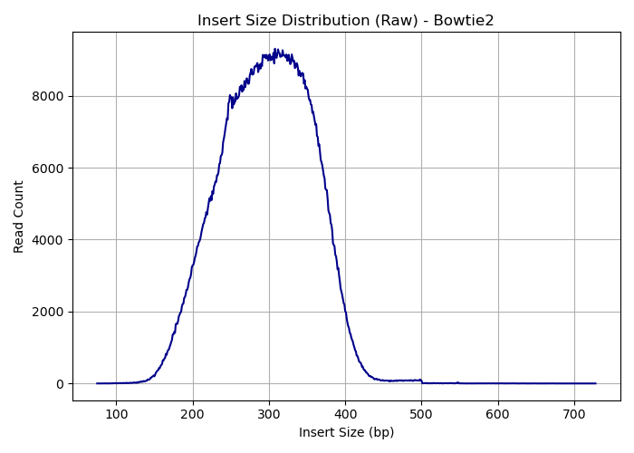

# Comparing Variant Calling Tools
Comparing different tools used in the variant calling pipeline. Replicating the work done in this paper: Comparison of Read Mapping and Variant Calling Tools for the Analysis of Plant NGS Data (Pucker et al. 2020).

## Aligners
Aligners being assessed in this project are: 
* BWA-MEM
* Bowtie2
* GEM3

### Comparing alignment metrics

These plots show the distribution of insert sizes before (first row) and after (second row) filtering. Reads with insert size lower than 100 or greater than 2000 were removed.

Before filtereing (raw SAM):

| BWA-MEM | Bowtie2 | GEM3 |
|--------|---------|-------|
| |  |  |

After filtering (100 <= insert size <= 2000):

| BWA-MEM | Bowtie2 | GEM3 |
|--------|---------|-------|
| |  |  |

This table shows an overview of the data:

| Metric | BWA | Bowtie2 | GEM3 |
| ------ | --- | ------- | ----- |
| Total reads | 24.0M | 4.85M | 28.2M |
| Mapped reads (%) | 100 | 100 | 100 |
| Properly paired (%) | 99.03 | 97.71 | 100 |
| Improperly paired (%) | 0.97 | 2.29 | 0 |
| Duplicates (%) | 41.6 | 37.3 | 41.7 |
| Mismatch rate (%) | 0.78 | 2.94 | 1.06 | 
| Error rate (%) | 0.70 | 2.18 | 0.76 |
| Indel rate (%) | 0.08 | 0.84 | 0.33 |
| MAPQ=0 reads (%) | 12.1 | 22.9 | 47.9 |
| Insert size (mean; bp) | 221.2 | 299.7 | 245.8 |
| Insert size (stdev; bp) | 79.3 | 52.2 | 131.4 |

### Conclusions

Look at alignment quality, all the reads were aligned to the reference genome for all aligners. It should be noted that the raw SAM out of the aligners were analyzed for insert size, and reads with insert sizes shorter than 100 or longer than 2000 were filtered out. The insert size histograms before and after filtering are shown above.

Most of the reads in BWA-MEM and Bowtie2 had their pair align as expected (matching orientation and distance from each other). 100% of the reads aligned using GEM3 achieved this. 

Mapping quality (MAPQ) describes the confidence with which a read has been aligned to a specific region of the genome. A lower MAPQ indicates that a read aligned to multiple regions with equal confidence, increasing the ambiguity of its alignment. BWA-MEM has the lowest proportion of reads with a MAPQ=0, whereas 47.9% of reads aligned by GEM3 are ambiguous. 

All aligners show similarly high duplication rate, indicating that there are many PCR duplicates detected by all aligners in this dataset. The proportion of chimeric reads are very high in BWA-MEM. Usually, chimeras are artificial reads that result from the library prep or PCR process. In the variant calling pipeline, they could result in false positives for structural variants.

The second plot shows error metrics for the aligners. The error rate reported here is the proportion of high quality aligned bases (that is, they have Q20 or greater) that are mismatches. The mismatch rate is the overall proportion of all bases that shows mismatches to the reference. The indel rate is the frequency of insertions/deletions in the aligned reads. BWA-MEM consistently shows the lowest scores in all these metrics, while Bowtie2 shows the highest scores, suggesting that BWA-MEM alignments are likely more accurate and of higher quality. 