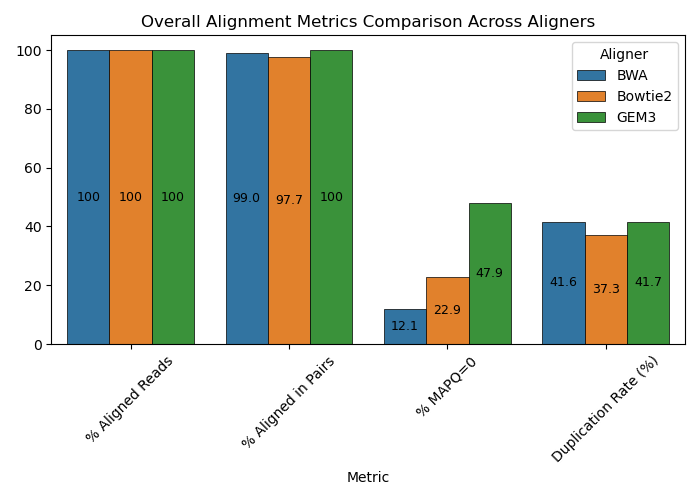

# Comparing Variant Calling Tools
Comparing different tools used in the variant calling pipeline. Replicating the work done in this paper: Comparison of Read Mapping and Variant Calling Tools for the Analysis of Plant NGS Data (Pucker et al. 2020).

## Aligners
Aligners being assessed in this project are: 
* BWA-MEM
* Bowtie2
* GEM3

### Comparing alignment metrics

These plots show the distribution of insert sizes before (first row) and after (second row) filtering. Reads with insert size lower than 100 or greater than 2000 were removed.

Before filtereing (raw SAM):

| BWA-MEM | Bowtie2 | GEM3 |
|--------|---------|-------|
| |  |  |

After filtering (100 <= insert size <= 2000):

| BWA-MEM | Bowtie2 | GEM3 |
|--------|---------|-------|
| |  |  |

The following are some plots showing main alignment metrics:

This table shows an overview of the data:

| **Metric**                  | **BWA** | **Bowtie2** | **GEM3** |
| --------------------------- | ------- | ----------- | -------- |
| **Total reads**             | 24.0M   | 4.85M       | 28.2M    |
| **Mapped reads (%)**        | 100     | 100         | 100      |
| **Properly paired (%)**     | 99.03   | 97.71       | 100      |
| **Improperly paired (%)**   | 37.3    | 41.7        | 0        |
| **Mismatch rate (%)**       | 0.78    | 2.94        | 1.06     |
| **Error rate (%)**          | 0.70    | 2.18        | 0.76     |
| **Indel rate (%)**          | 0.08    | 0.84        | 0.33     |
| **MAPQ=0 reads (%)**        | 12.1    | 22.9        | 47.9     |
| **Insert size (mean; bp)**  | 221.2   | 299.7       | 245.8    |
| **Insert size (stdev; bp)** | 79.3    | 52.2        | 131.4    |

### Conclusions

Looking at alignment quality, all the reads were aligned to the reference genome for all aligners. It should be noted that the raw SAM out of the aligners were analyzed for insert size, and reads with insert sizes shorter than 100 or longer than 2000 were filtered out. The insert size histograms before and after filtering are shown above.

Most of the reads in BWA-MEM and Bowtie2 had their pair align as expected (matching orientation and distance from each other). 100% of the reads aligned using GEM3 achieved this. 

Mapping quality (MAPQ) describes the confidence with which a read has been aligned to a specific region of the genome. A lower MAPQ indicates that a read aligned to multiple regions with equal confidence, increasing the ambiguity of its alignment. BWA-MEM has the lowest proportion of reads with a MAPQ=0, whereas 47.9% of reads aligned by GEM3 are ambiguous. All aligners show similarly high duplication rate, indicating that there are many PCR duplicates detected by all aligners in this dataset.

The second plot shows error metrics for the aligners. The error rate reported here is the proportion of high quality aligned bases (that is, they have Q20 or greater) that are mismatches. The mismatch rate is the overall proportion of all bases that shows mismatches to the reference. The indel rate is the frequency of insertions/deletions in the aligned reads. BWA-MEM consistently shows the lowest scores in all these metrics, while Bowtie2 shows the highest scores, suggesting that BWA-MEM alignments are likely more accurate and of higher quality. 

From these data, BWA-MEM appears to be the best aligner to use for this Arabidopsis thaliana dataset, considering the low error rates and high alignment quality.

## Variant Callers
Variant callers being assessed in this project are:
* GATK HaplotypeCaller
* FreeBayes

### Comparing variant caller metrics 

These metrics are collected from Illumina's hap.py tool, which assesses performance of variant callers against a truth set. I used the  from Schilbert H, Rempel A & Pucker B (2020) as the truth set. 

TP, FP and FN counts:

| **Metric**          | **HaplotypeCaller** | **FreeBayes**   |
| ------------------- | ------------------- | --------------- |
| **True Positives**  | 563,832             | **581,205**     |
| **False Positives** | **262,693**         | 414,366         |
| **False Negatives** | 940,135             | **922,762**     |

Overall scores:

| **Metric**      | **HaplotypeCaller**           | **FreeBayes** |
| --------------- | ----------------------------- | ------------- |
| **Precision**   | **0.682**                     | 0.584         |
| **Recall**      | 0.375                         | **0.386**     |
| **F1 Score**    | **0.481**                     | 0.464         |

Scores grouped by variant type:

| **Variant Type** | **Caller**          | **Precision** | **Recall**    | **F1 Score**  | **Ti/Tv (Query)** | **Het/Hom (Query)** |
| ---------------- | ------------------- | ------------- | ------------- | ------------- | ----------------- | ------------------- |
| **SNP**          | HaplotypeCaller     | **0.699**     | 0.377         | **0.490**     | 1.24              | 0.20                |
| **SNP**          | FreeBayes           | 0.590         | **0.402**     | 0.478         | 1.23              | **0.33**            |
| **INDEL**        | HaplotypeCaller     | **0.605**     | **0.366**     | **0.456**     | —                 | 0.17                |
| **INDEL**        | FreeBayes           | 0.548         | 0.306         | 0.393         | —                 | 0.23                |

### Conclusions 

In general, both variant callers perform similarly besed on these metrics. GATK HaplotypeCaller has a better precision and F1 score than FreeBayes for the data in this experiment, which indicates greater accuracy in the variants it is calling. On the other hand, FreeBayes has a slightly better recall (sensitivity) score, indicating that it finds a greater number of true variants. However, FreeBayes also has more false positives than HaplotypeCaller, which contributes to its lower precision score. 

The Ti/Tv and Het/Hom ratios are also in expected ranges. Since I am finding intraspecies variants between Nd-1 and Col-0 ecotypes of Arabidopsis thaliana, the expected Ti/Tv ratio for this comparison is 1.0-1.4. Likewise, a low Het/Hom (<0.5) ratio is expected due to the high amount of inbreeding in Arabidopsis, resulting in a highly homozygous genome.